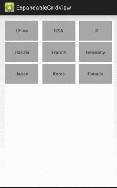

# ExpandableGridView

##Introduction
This is a customized Android expandable GridView, which can expand/collapse grid view under touched item view and insert a new sub grid view in the expanded space. By using ExpandableGridView, you can get OSX/iOS expand folder like experience.

##Demo

##Solution
The idea of the "expand functionality" is to add a cover layer upon the grid view. Take a snapshot of the grid view and split it to two part. Add the two splited images into the cover layer, this will create an experience of split/expand the grid view. Then insert a sub grid view into the middle of the cover layer. Add the cover layer to the grid view's parent and bring it to the front. Expand function has achieved.

Register click listener to the up/down images in cover layer. When the two parts are clicked, remove the cover layer and sub grid view. The hidden grid view will display again. This will create the experience of "collapse" grid view.

##Usage
0. Include the class `ExpandableGridView.java` in your project.
1. In the layout resource file, define a `ExpandableGridView`. Set the properties as `GridView` does.
2. In the activity, init the `ExpandableGridView`, set adapter and item click listener to grid view. When item is clicked, expand grid view, e.g.:

        ExpandableGridView countryGridView = (ExpandableGridView)findViewById(R.id.country_grid);
        ArrayAdapter<String> countryAdapter = new ArrayAdapter<String>(getBaseContext(),R.layout.grid_item, R.id.grid_item, countryData);
        
        // 1.Set adapter for the grid view
        countryGridView.setAdapter(countryAdapter);
        
        // 2.Add click event listener to the grid view, expand grid view when item is clicked
        countryGridView.setOnItemClickListener(new AdapterView.OnItemClickListener() {
            @Override
            public void onItemClick(AdapterView<?> parent, View view, int position, long id) {
                // expand the grid view
                countryGridView.expandGridViewAtView(view, new ArrayAdapter<String>(getBaseContext(),
                        R.layout.grid_item, R.id.grid_item, stateData));
            }
        });

3. Register `OnExpandItemClickListener` to the grid view. When the expand sub grid item is clicked, the listener will be called.

        // 3.Click event listener of sub GridView items
        countryGridView.setOnExpandItemClickListener(new ExpandableGridView.OnExpandItemClickListener() {
            @Override
            public void onItemClick(int position, Object clickPositionData) {
                Toast.makeText(getBaseContext(), clickPositionData.toString()+" clicked", Toast.LENGTH_LONG).show();
            }
        });
        
>Notice: the uper parent group of the grid view should be 'RelativeLayout'. Otherwise, the expanded grid view may can not be shown normally.

##Customization
This `ExpandableGridView` is only a kind of expand solution, that to display another sub grid view in the expand space. If you wanna have some other customized sub views in the expand space, you can customize the `ExpandableGridView.java` as you like.

The whole idea of the expand functionality will not change. You only need to change the `middleView` in the `ExpandableGridView.java` to your view, and adjust the height of it. It should work!

##Contact

- [thewaychung@gmail.com](mailto:thewaychung@gmail.com)
